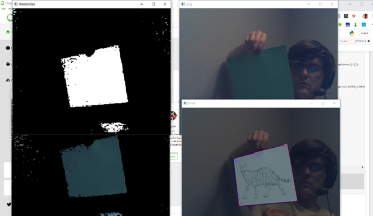

# ComputerVisionFinal
This project dynamically overlays an image onto a placeholder item in a webcam feed.

A green piece of paper is used as the placeholder image, and the input image is overlaid onto the green sheet of paper. 

